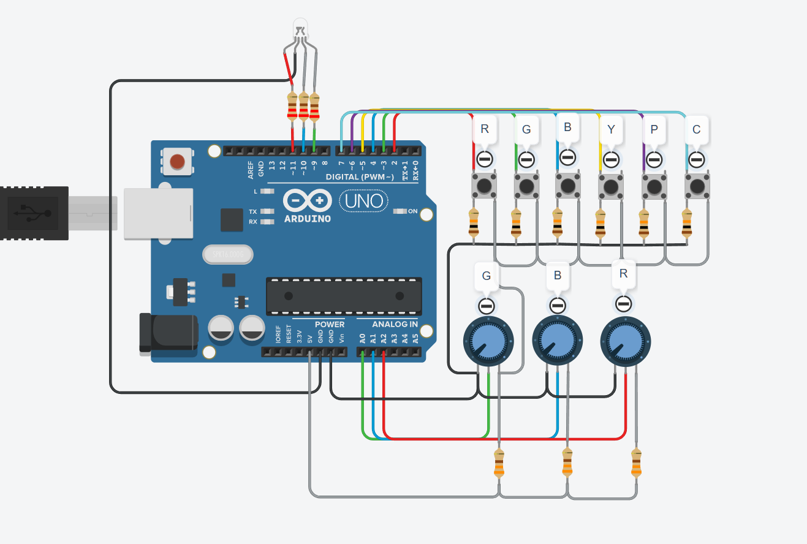

# Controle RGB com Arduino  

Um projeto desenvolvido como **avaliação prática da faculdade**, composto por **3 exercícios integrados em um único código**, cada um implementado em uma **função independente**.  
O objetivo geral é explorar diferentes formas de controle de um **LED RGB** utilizando **interruptores**, **potenciômetros** e **transições suaves com millis()**.

---

## Componentes Utilizados  

- 🟦 1x Arduino UNO  
- 🔴 1x LED RGB (cátodo comum)  
- 🔘 6x Botões (para cores primárias e secundárias)  
- 🎚️ 3x Potenciômetros (para controle analógico das cores)  
- 🪫 Resistores (220Ω e 10kΩ)  
- 🔌 Jumpers macho-macho  

---

## Circuito  

Visualização do circuito montado no **Tinkercad**:  

---

## Estrutura do Projeto  

O código foi dividido em três funções principais, correspondentes a cada exercício:

### Exercício 1 — Controle de Cores com Interruptores  
> **Descrição:**  
> Controla as cores primárias e secundárias de um LED RGB utilizando interruptores.  
> Cada interruptor ativa uma cor específica (R, G, B, Y, P, C).  

---

### Exercício 2 — Controle Analógico de Cores com Potenciômetros  
> **Descrição:**  
> Permite controlar continuamente a intensidade de cada cor primária (Vermelho, Verde e Azul) usando potenciômetros.  
> Assim, é possível criar misturas de cores analógicas e suaves em tempo real.  

---

### Exercício 3 — Transição Suave de Cores (Fade) com `millis()`  
> **Descrição:**  
> Cria um efeito de **transição suave (fade)** entre as cores primárias do LED RGB.  
> O tempo é controlado de forma **não bloqueante** com `millis()`, permitindo alternar entre vermelho, verde e azul com `analogWrite()` sem travar o loop principal.  

---

## Funcionamento Geral  

| Cor | Componentes Ativos |
|------|--------------------|
| 🔴 Vermelho | R |
| 🟢 Verde | G |
| 🔵 Azul | B |
| 🟡 Amarelo | R + G |
| 🟣 Magenta | R + B |
| 🔵 Ciano | G + B |

Os potenciômetros controlam a intensidade de cada canal RGB, enquanto o modo “fade” alterna automaticamente entre as cores.

---

## Código  

O código completo pode ser encontrado aqui: [`codigo.ino`](codigo.ino)  

Ele inclui:
- Leitura de botões e potenciômetros  
- Controle PWM com `analogWrite()`  
- Uso de `millis()` para controle de tempo sem `delay()`  
- Estrutura modular com funções separadas para cada exercício  

---

## Aprendizados  

- Diferença entre **entradas digitais e analógicas**  
- Controle de brilho via **PWM**  
- Uso de **millis()** para controle não bloqueante  
- Organização modular de código Arduino  
- Conceitos práticos de **mistura de cores RGB**

---

## Resultado  

Um sistema interativo e educativo que une três abordagens de controle de LEDs RGB, demonstrando diferentes técnicas e boas práticas de programação embarcada.  

> “Aprender é transformar curiosidade em criação.” ✨  
